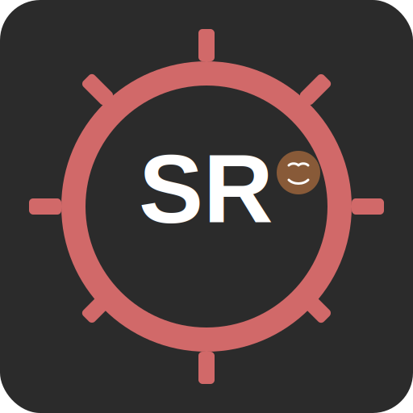

# ShitRust

<div align="center">
  
</div>

ShitRust is a programming language that combines features from Rust, Python, and C/C++.

## Features

- Memory safety inspired by Rust
- Simplicity and readability from Python
- Performance and low-level control from C/C++
- Modern syntax with clear error messages
- Strong typing with type inference
- LLVM-based optimizing compiler
- Interactive interpreter for rapid development
- Code formatter for consistent code style

## New Features in this Version

- Improved error reporting with source location information
- Enhanced LLVM code generation with optimization levels
- Support for asynchronous programming (async/await)
- Pattern matching with enhanced capabilities
- Range expressions for easier iteration
- Built-in formatter for consistent code style
- Better diagnostics and verbose output options
- Compilation timing information
- Option to emit LLVM IR for debugging
- Colorized output with option to disable
- New logo and branding assets
- Improved build scripts for Windows and Unix platforms
- Enhanced documentation

## Installation

```bash
# Clone the repository
git clone https://github.com/yourusername/shitrust.git
cd shitrust

# Build the compiler
# Windows
build.bat

# Linux/macOS
./build.sh

# Install the binary (optional)
cargo install --path .
```

## Usage

```bash
# Compile a ShitRust program
shitrust compile examples/hello.sr

# Run a ShitRust program (without generating executable)
shitrust run examples/hello.sr

# Format a ShitRust program
shitrust format examples/hello.sr

# Show information about ShitRust
shitrust info

# Show help
shitrust --help
```

### Compiler Options

```bash
# Compile with verbose output
shitrust -v compile examples/hello.sr

# Compile with specific optimization level
shitrust -o aggressive compile examples/hello.sr

# Compile with debug information
shitrust -d compile examples/hello.sr

# Compile with timing information
shitrust -t compile examples/hello.sr

# Compile and emit LLVM IR (creates a .ll file alongside the executable)
shitrust --emit-llvm compile examples/hello.sr

# Disable colored output
shitrust --no-color compile examples/hello.sr

# Format a file in-place
shitrust format -i examples/hello.sr
```

## Build Script Usage

The project includes build scripts for both Windows and Unix platforms.

### Windows (build.bat)

```batch
# Show help
build.bat help

# Build debug version
build.bat

# Build release version
build.bat release

# Clean build artifacts
build.bat clean

# Install ShitRust compiler
build.bat install

# Run tests
build.bat test

# Run examples
build.bat examples

# Run benchmark with timing information
build.bat bench

# Generate documentation
build.bat docs

# Create assets directory
build.bat assets

# Show ShitRust information
build.bat info
```

### Linux/macOS (build.sh)

```bash
# Show help
./build.sh help

# Build debug version
./build.sh

# Build release version
./build.sh release

# Clean build artifacts
./build.sh clean

# Install ShitRust compiler
./build.sh install

# Run tests
./build.sh test

# Run examples
./build.sh examples

# Run benchmark with timing information
./build.sh bench

# Generate documentation
./build.sh docs

# Create assets directory
./build.sh assets

# Show ShitRust information
./build.sh info
```

## Examples

Check the examples directory for sample ShitRust programs:

- `hello.sr` - A simple "Hello World" program
- `hello_world.sr` - A more complete introductory example
- `features.sr` - Demonstrates basic language features
- `advanced.sr` - Demonstrates advanced language features

## Language Overview

### Basic Syntax

```rust
// Function definition
fn add(a: int, b: int) -> int {
    return a + b;
}

// Variables
let x = 5;          // Type inference
let mut y = 10;     // Mutable variable
let z: float = 3.14; // With type annotation

// Control flow
if x > y {
    println("x is greater");
} else {
    println("y is greater");
}

// Loops
while x > 0 {
    x = x - 1;
}

for i in 0..10 {
    println(i.to_string());
}

// Match statement
match x {
    0 => println("Zero"),
    1 => println("One"),
    _ => println("Other"),
}
```

### Advanced Features

```rust
// Structs
struct Point {
    x: float,
    y: float,
    
    fn distance_from_origin() -> float {
        return (this.x * this.x + this.y * this.y).sqrt();
    }
}

// Async functions
async fn fetch_data() -> string {
    // Async code here
    return "data";
}

// Using async/await
fn main() -> void {
    let data = await fetch_data();
    println(data);
}

// Error handling with try/catch
try {
    let result = some_function_that_might_fail();
} catch err {
    println("Error: " + err.to_string());
} finally {
    cleanup();
}
```

## Branding and Assets

The ShitRust logo and branding assets are available in the `assets` directory:

- `icon.svg` - Vector version of the logo
- `icon.png` - Raster version in various sizes
- `favicon.html` - Example of using the logo as a website favicon

To convert the SVG to various formats, see `assets/icon.png.md` for instructions.

## Documentation

To generate documentation:

```bash
# Windows
build.bat docs

# Linux/macOS
./build.sh docs
```

This will create documentation in `target/doc/shitrust/index.html`.

## Contributing

Contributions are welcome! Please feel free to submit a Pull Request.

1. Fork the repository
2. Create your feature branch: `git checkout -b feature/amazing-feature`
3. Commit your changes: `git commit -m 'Add some amazing feature'`
4. Push to the branch: `git push origin feature/amazing-feature`
5. Open a Pull Request

## License

This project is licensed under the MIT License - see the LICENSE file for details. 